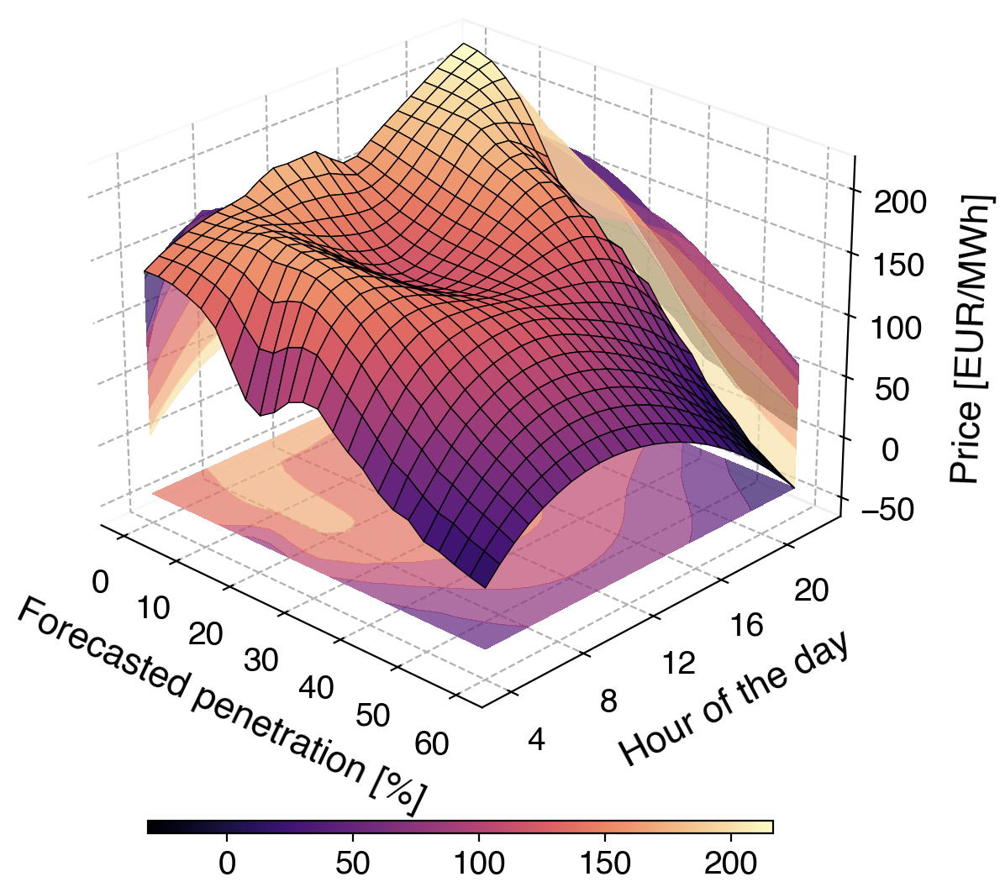
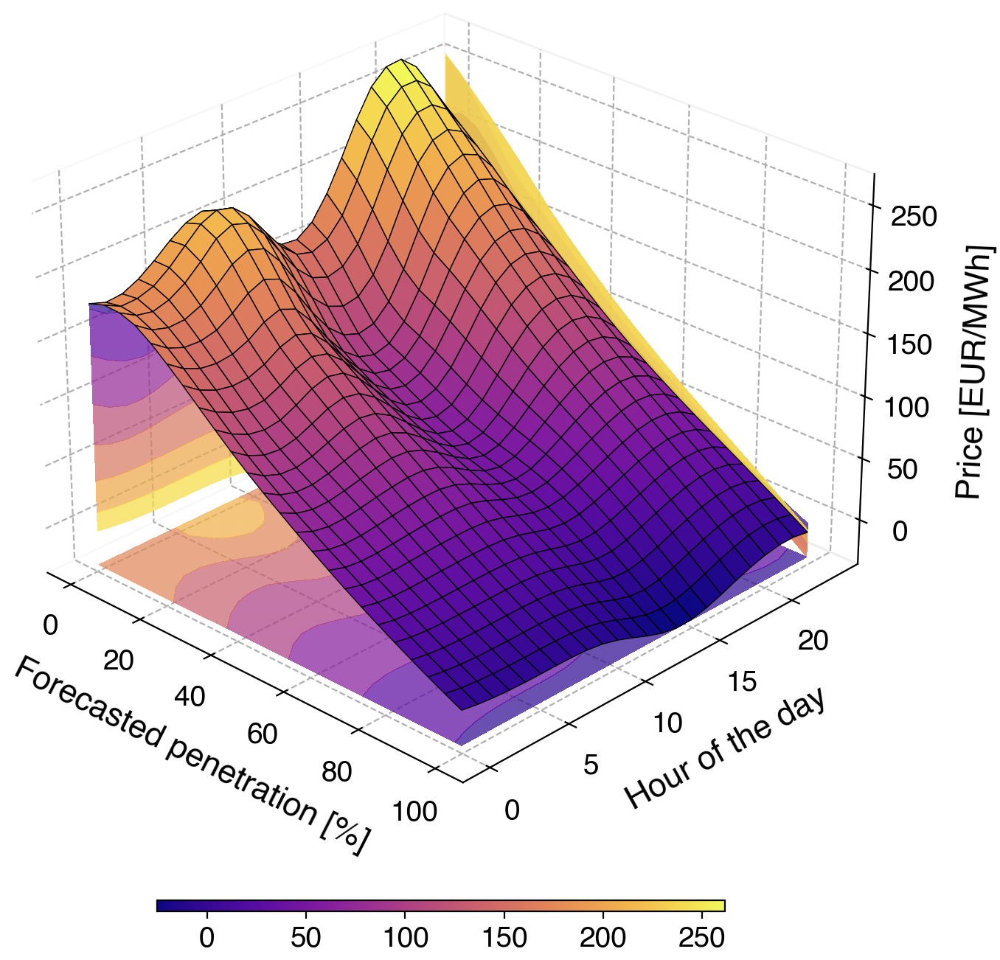
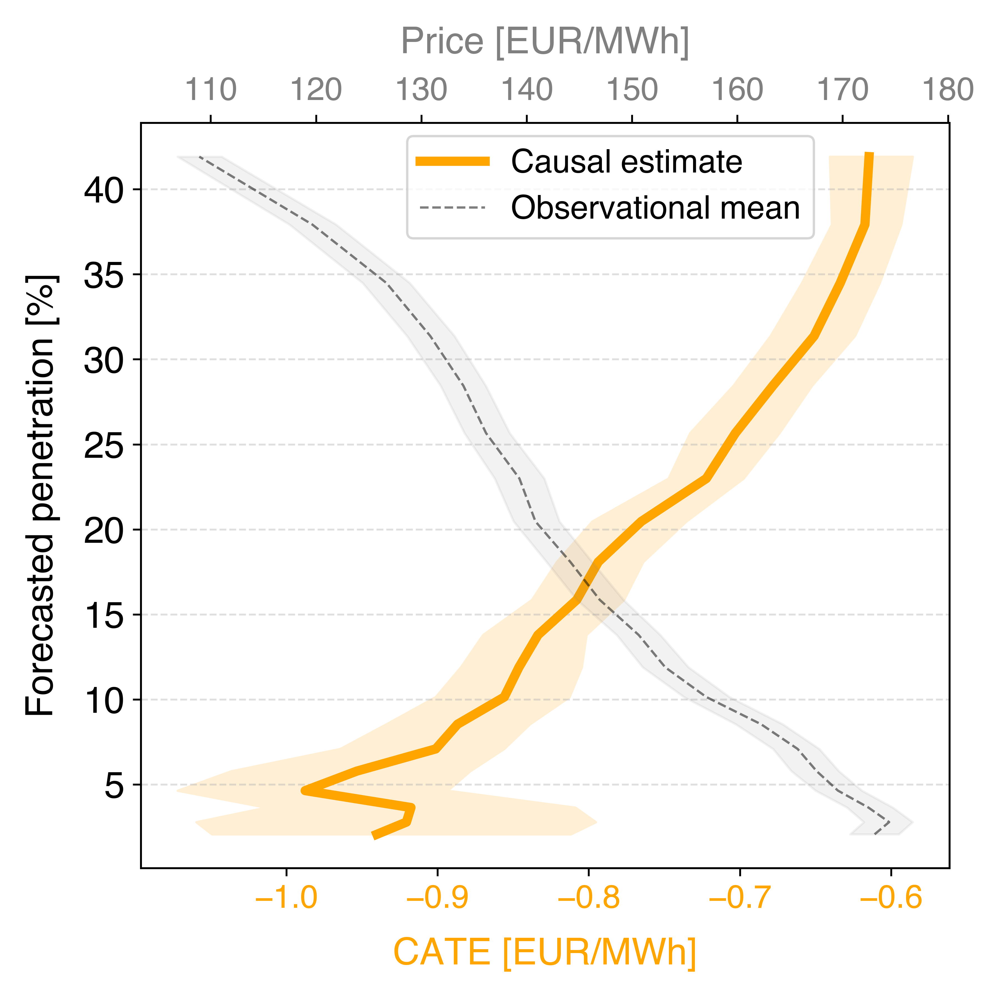
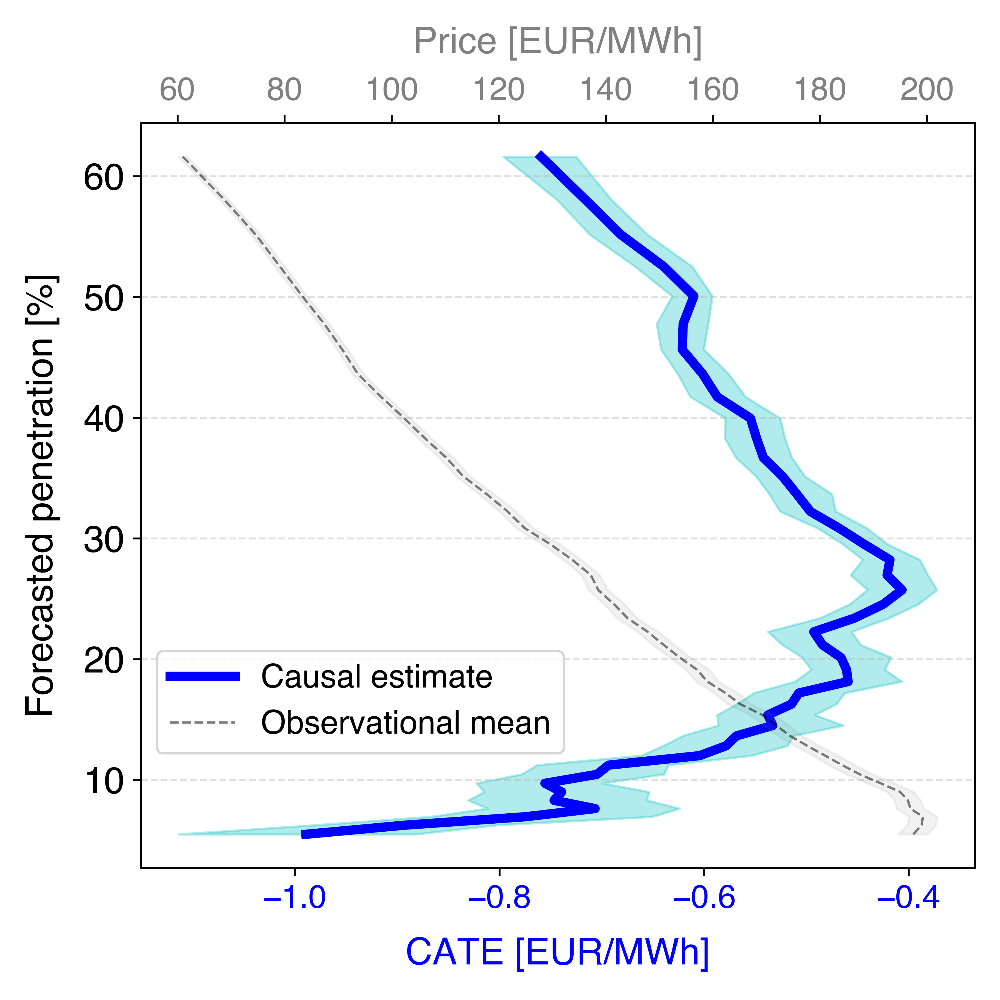

# Power Market Modeling
**Causal Analysis of Renewable Energy Penetration and Electricity Price Forecasting with Transformers**

*Master’s Thesis – Humboldt-Universität zu Berlin*  
*Author : Emircan Ince*  
*Supervisors : Prof. Dr. Stefan Lessmann · Prof. Dr. Jan Mendling*

## Causal Impact of Renewable Penetration

This section quantifies the short-run price effects of renewable generation in the German day-ahead market. Two estimators are used:

1. **LWPR** – Smooths observational prices over penetration and hour of day.
2. **DML (CATE)** – Estimates causal effects with bootstrap-based confidence.

---

### Merit-Order Surfaces (LWPR)

| Solar Penetration | Wind Penetration |
|-------------------|------------------|
|  |  |

- **Solar**: Steep price drops up to ~25%; strongest around noon (e.g. −3.1 €/MWh at 15%, 12:00). Effect weakens beyond 30%.
- **Wind**: Consistent decline up to ~60% share. Smoother and persistent impact across 24h, especially overnight.

---

### Causal Effects (DML - CATE)

| Solar | Wind |
|-------|------|
|  |  |

- **Solar CATE**: Strong at low shares (−0.95 €/MWh at 5%). Weakens but remains negative beyond 30%.
- **Wind CATE**: Stable impact (−0.8 €/MWh up to 10%, −0.75 €/MWh around 30%). Persists up to 60%.

**Confidence Intervals**: Wider at extreme values due to fewer observations. CATE always below observational mean → mean underestimates true effect.

---

### Key Insight

- **Solar**: High initial impact, but saturates fast — limited marginal effect beyond mid-penetration, especially at noon.
- **Wind**: Sustained price-reducing effect across hours and levels — more robust for system-wide cost reduction.

## Forecasting Results

Out-of-sample accuracy is evaluated for six models over July–December 2024, across four horizons: 24, 48, 96, and 168 hours.  
Metrics: Mean Squared Error (MSE) and Mean Absolute Error (MAE).

---

### Quantitative Performance

| Horizon | TimeXer | iTransformer | PatchTST | DLinear | SCINet | Autoformer |
|---------|---------|--------------|----------|---------|--------|-------------|
| 24h     | **0.208 / 0.114** | 0.302 / 0.212 | 0.380 / 0.288 | 0.209 / 0.118 | 0.210 / 0.117 | 0.261 / 0.153 |
| 48h     | 0.243 / 0.152 | 0.303 / 0.217 | 0.360 / 0.269 | **0.234 / 0.147** | 0.247 / 0.154 | 0.268 / 0.175 |
| 96h     | 0.274 / 0.187 | 0.318 / 0.236 | 0.330 / 0.251 | **0.254 / 0.172** | 0.288 / 0.205 | 0.280 / 0.191 |
| 168h    | 0.278 / 0.192 | 0.322 / 0.240 | 0.368 / 0.274 | **0.263 / 0.186** | 0.289 / 0.204 | 0.285 / 0.201 |

*Each cell: MAE / MSE (best values bolded).*

- **TimeXer**: Best at 24h; remains top-2 at all horizons.
- **DLinear**: Most accurate from 48h onward, highlighting the strength of compact linear models.
- **PatchTST**: Declines at 168h, indicating limited long-range generalization.
- **SCINet / Autoformer**: Competitive at longer ranges, despite slightly higher MSE.

---

### Horizon-Wise Trends

- **Error Growth**: All models degrade with horizon, but TimeXer’s error curve is the flattest — preserving patterns best over time.
- **Linear Advantage**: DLinear outperforms deep models beyond 24h, benefiting from low-variance bias and strong seasonality structure.
- **Transformer Diversity**: iTransformer is strong short-term; Autoformer more stable for long horizons via decomposition mechanisms.

## Working with the Repository

### Dependencies

Developed with:

- **Python 3.9**  
- **PyTorch 2.2**  
- **LightGBM 4.3**  
- **HuggingFace Transformers**

All dependencies are listed and pinned in `requirements.txt`.

---

### Setup

```bash
# Clone the repository
git clone https://github.com/emircanince/power.git
cd power

# Create and activate a virtual environment
python -m venv venv
source venv/bin/activate      # for Linux/macOS
pip install -r requirements.txt
```

---

## Reproducing Results

### Causal Analysis

To compute the LWPR surface, overall DML estimate, and CATE vs. observational mean:

```bash
python models/nonlinear_regression_models/LWPR_mean_wind.py
python models/double_machine_learning/DML_overall_wind.py
python models/double_machine_learning/dml_vs_mean_plot_wind.py
```

Outputs are written to CSV and saved as figures in the `png/` directory.

---

### Forecasting Experiments

To train and evaluate **TimeXer** and the baseline models:

```bash
chmod +x scripts/TimeXer.sh      # run once
bash scripts/TimeXer.sh --pred_len 24    # options: 24 / 48 / 96 / 168
```

The script handles data loading, training, checkpoints, and TensorBoard logging automatically.

---

### Visualization

Open `Visualization.ipynb` to:

1. Plot bootstrapped CATE estimates  
2. Overlay DML effects on LWPR surfaces  
3. Animate TimeXer’s forecast learning trajectory

---

### Pre-trained Models

To skip training:

```bash
unzip ckpt.zip -d ckpt
```

Move the extracted model folders into `./checkpoints/`.

## Project Structure

```text
.
├── ckpt.zip                          # Pre-trained model checkpoints
├── requirements.txt                  # Dependency specification
├── README.md                         # ← You are here
├── models
│   ├── nonlinear_regression_models
│   │   └── LWPR_mean_wind.py        # Merit-order surface estimation (LWPR)
│   └── double_machine_learning
│       ├── DML_overall_wind.py      # Average treatment effect (DML)
│       └── dml_vs_mean_plot_wind.py # CATE vs. observational mean plot
├── scripts
│   └── TimeXer.sh                    # Shell launcher for forecasting models
├── data                              # Hourly price & forecast data (not tracked)
└── png                               # Output figures and plots
```

Happy forecasting!