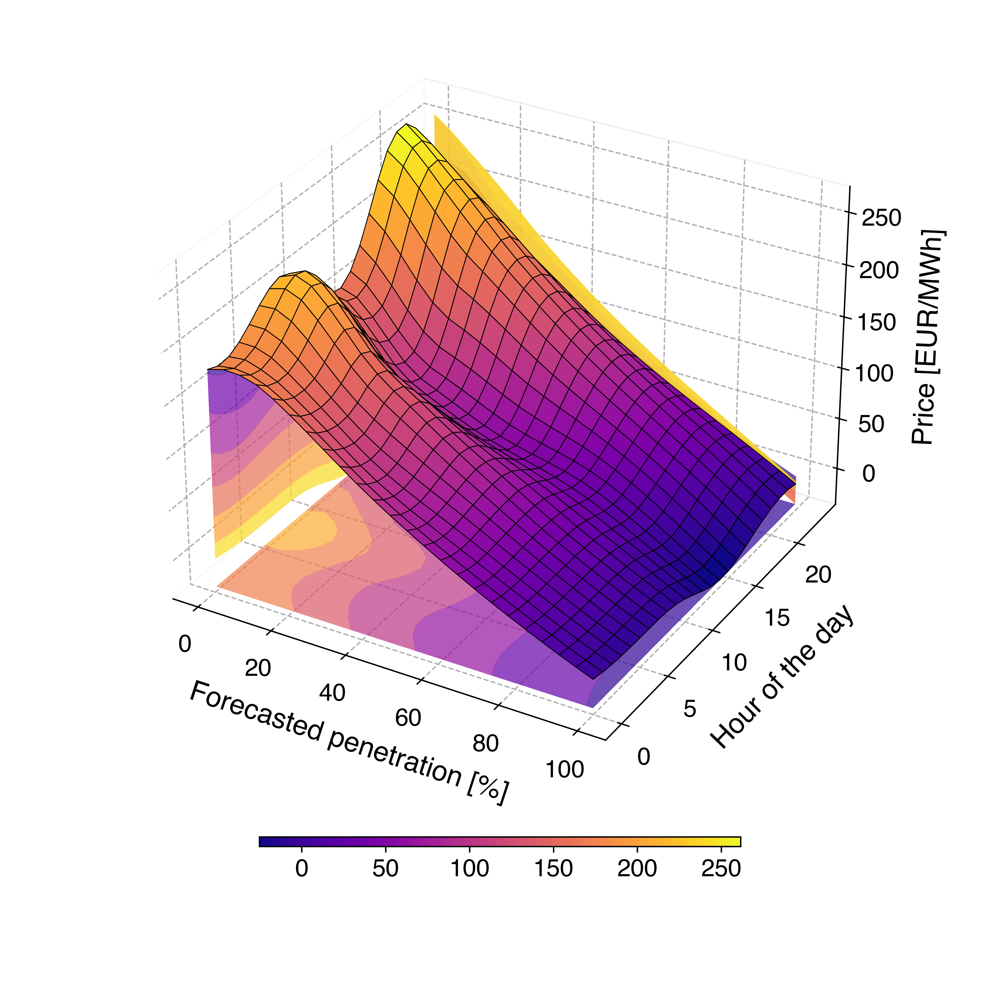

# ⚡ Power Market Modeling

**Causal Analysis of Renewable Energy Penetration and Electricity Price Forecasting with Transformers**

This repository investigates the impact of renewable energy sources on electricity prices using causal inference techniques and forecasts power market dynamics using deep learning models, particularly Transformers.

---

## 🔍 Results Overview

### Local Weighted Polynomial Regression (LWPR)

<div align="center">
  
  
</div>

### Conditional Average Treatment Effect (CATE) Estimates

<div align="center">
  
  
</div>

---

## 🛠️ Getting Started

### Requirements

Install the required dependencies:

```bash
pip install -r requirements.txt